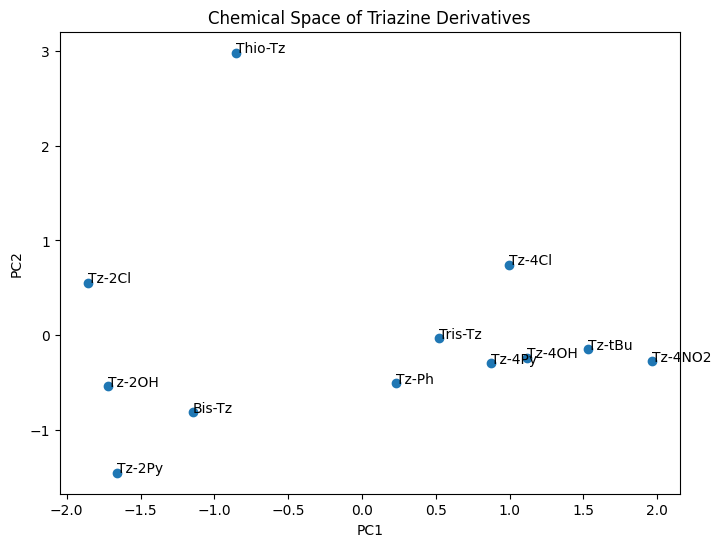

# Triazine Cheminformatics

A cheminformatics workflow for the design, analysis, and virtual screening of triazine derivatives using Python and RDKit.

## Project Overview

This project aims to combine synthetic organic chemistry with cheminformatics to prioritize novel and metal sensing triazine derivatives before synthesis.

The workflow includes:

- Molecular descriptor calculation of synthesized derivatives 
- Structural similarity analysis of them
- Chemical space visualization
- Compound prioritization 
- Virtual screening of aromatic hydrazides from PubChem
- Virtual One-Pot 1,2,4-triazine synthesis and filtering it using lipinski's rule.
- Selection of promising candidates for future triazine synthesis

---

## Project Structure

```
triazine-cheminformatics/
│
├── data/
│   ├── triazine_dataset.csv
│   └── hydrazide_library.csv
│
├── notebooks/
│   ├── 01_descriptor_calculation.ipynb
│   ├── 02_priority_scoring.ipynb
│   ├── 03_similarity_analysis.ipynb
│   ├── 04_
│
├── results/
│   ├── descriptors.csv
│   ├── filtered_hydrazide.csv
│   ├── similarity_matrix.csv
│   └── triazine_dataset.csv
│
├── src/
└── README.md
```

## Current Progress

-  Descriptor calculation using RDKit
-  Molecular fingerprints (Morgan Fingerprints)
-  Tanimoto similarity analysis
-  Similarity matrix generation
-  PCA visualization
-  Hierarchical clustering
-  Compound ranking
-  PubChem hydrazide library preparation
-  Drug-like filtering of aromatic hydrazides
-  Virtual One-Pot synthesis of 1,2,4-triazine 
from the filtered hydrazide library.
-  Drug-like filtering of synthesized triazines
Current filtered library:

**10000 hydrazide from pubchem*** ---> **6855 aromatic hydrazides**


---

## Technologies

- Python
- RDKit
- Pandas
- NumPy
- Matplotlib
- Seaborn
- Scikit-learn

---

## Future Work

- prioritizing triazines for Metal sensing application 
- Chemical diversity selection
- Novelty analysis
- Machine learning models
- QSPR modelling

---
## Chemical Space Visualization



---

## Author
Ajay K
