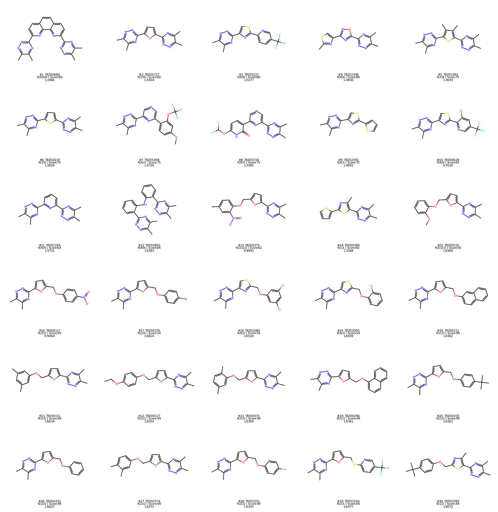
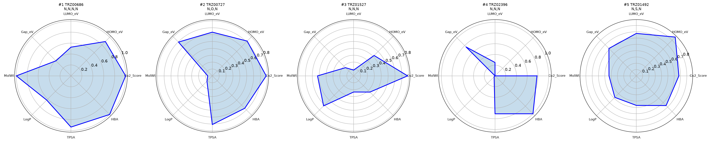

# Virtual Screening Pipeline for Potential Tridentate 1,2,4-Triazine Ligands for Cu²⁺ Sensing

An end-to-end cheminformatics workflow for the automated discovery and prioritization of potential tridentate 1,2,4-triazine ligands relevant to Cu²⁺ sensing applications. Starting from a virtual hydrazide library, the pipeline performs reaction enumeration, molecular descriptor generation, SMARTS-based donor atom and chelation motif identification, structural filtering, molecular fingerprint similarity analysis using manually curated tridentate ligand scaffolds, and semiempirical quantum chemical calculations (GFN2-xTB) to prioritize candidates based on their structural and electronic properties. The workflow is fully reproducible, modular, and implemented using open-source Python tools, providing a scalable framework for computational ligand discovery.

---

# Top Ranked Candidate Molecules

<p align="center">
  
</p>

*Top 30 candidate tridentate ligands selected after structural filtering, similarity analysis, and quantum chemical screening.*

---

# Project Highlights

- End-to-end automated virtual screening workflow
- Virtual reaction enumeration of 1,2,4-triazine derivatives
- SMARTS-based identification of donor atoms and chelation motifs
- Physicochemical descriptor generation using RDKit
- Identification of potential tridentate ligand architectures
- Molecular fingerprint similarity analysis using manually curated reference ligands
- Semiempirical quantum chemical screening using GFN2-xTB
- Automated ranking of candidates based on structural and electronic descriptors
- Modular and reproducible Python workflow

---

# Workflow

```
Hydrazide Library
        │
        ▼
Virtual Reaction Enumeration
        │
        ▼
Molecular Descriptor Generation
        │
        ▼
SMARTS-Based Structural Filtering
        │
        ▼
Donor Atom & Chelation Motif Identification
        │
        ▼
Reference Ligand Similarity Analysis
        │
        ▼
GFN2-xTB Quantum Calculations
        │
        ▼
Candidate Ranking & Visualization
```

*A graphical workflow diagram can be substituted for the above schematic.*

---

# Screening Summary

| Stage | Description | Molecules Remaining |
|:------|:------------|-------------------:|
| Initial Library | Virtual hydrazide library | 10000 |
| Reaction Enumeration | Virtual 1,2,4-triazine derivatives | 5941 |
| Structure Validation | RDKit sanitization and validation | 4999 |
| Descriptor Calculation | Molecular descriptor generation | 4951 |
| SMARTS Filtering | Identification of donor atom-containing molecules | 3263 |
| Chelation Screening | Selection of potential tridentate ligand motifs | 1214  |
| Similarity Analysis | Comparison with manually curated reference ligands | 183 |
| Quantum Screening | GFN2-xTB electronic property calculations | 30 |

---

# Reference Ligand Set

The similarity analysis was performed using a manually curated collection of representative tridentate ligand scaffolds identified during structural inspection of the virtual library. These reference compounds were selected based on their donor atom arrangement and chelation geometry rather than experimentally validated Cu²⁺ sensing activity. Morgan fingerprint similarity was subsequently used to identify structurally related candidates exhibiting comparable coordination motifs for further quantum chemical screening.

---

# Technologies

- Python
- RDKit
- Pandas
- NumPy
- Matplotlib
- Jupyter Notebook
- GFN2-xTB

---

# Repository Structure

```text
TRIAZINE_METAL_SENSING_PROJECT
│
├── data
│   ├── hydrazide_library.csv
│   └── reference_compounds.csv
│
├── notebooks
│   ├── 01_hydrazide_cleaning.ipynb
│   ├── 02_virtual_reaction.ipynb
│   ├── 03_Metal_sensing_App.ipynb
│   └── 04_Quantum_Screening.ipynb
│
├── results
│   ├── figures
│   │   ├── top30_molecules.png
│   │   └── radar_for_top5.png
│   │
│   ├── quantum_screening_data
│   ├── Metal_sensing_mol.csv
│   ├── electronic_prop.csv
│   ├── hydrazides.csv
│   ├── triazines.csv
│   └── xtb_baseline_screening.csv
│
├── src
│   └── automated_screening.py
│
├── cheminfo.yml
├── README.md
└── LICENSE
```

---

# Repository Outputs

| Output | Description |
|:-------|:------------|
| `triazines.csv` | Complete virtual triazine library |
| `Metal_sensing_mol.csv` | Filtered candidate tridentate ligands |
| `electronic_prop.csv` | HOMO, LUMO and HOMO–LUMO gap values |
| `xtb_baseline_screening.csv` | Electronic properties from GFN2-xTB calculations |
| `top30_molecules.png` | Top-ranked candidate structures |
| `radar_for_top5.png` | Comparison of normalized molecular and electronic properties of the top five candidates |

---

# Electronic Property Comparison

<p align="center">
  
</p>

*Normalized comparison of molecular descriptors and electronic properties for the five highest-ranked candidate ligands.*

---

# Installation

Clone the repository

```bash
git clone https://github.com/<username>/TRIAZINE_METAL_SENSING_PROJECT.git
cd TRIAZINE_METAL_SENSING_PROJECT
```

Create the environment

```bash
conda env create -f cheminfo.yml
conda activate cheminfo
```

Run the complete workflow

```bash
python src/automated_screening.py
```

Alternatively, execute the Jupyter notebooks sequentially to reproduce each stage of the screening pipeline.

---

# Future Work

- Density Functional Theory (DFT) optimization of prioritized ligands
- Cu²⁺ complex geometry optimization and binding energy calculations
- Machine learning models for ligand prioritization
- Extension to additional transition-metal ions
- Experimental synthesis and validation of selected candidates

---

# License

This project is distributed under the MIT License.